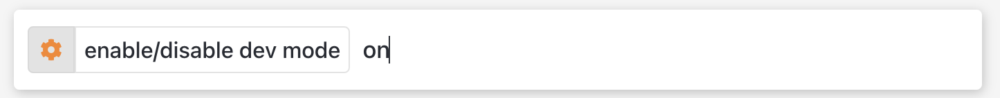
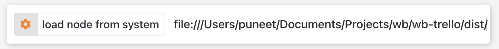
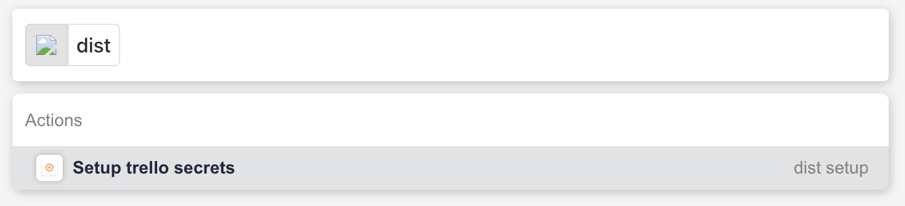
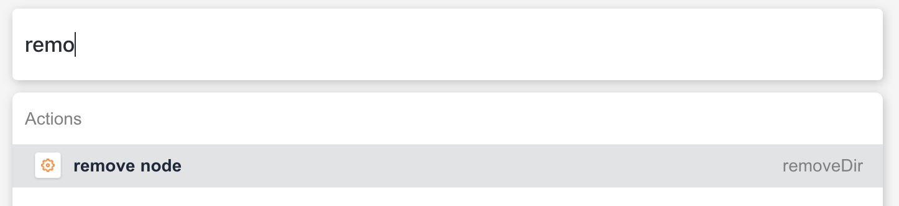
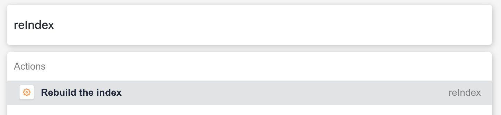

<h1 align="center">wb-trello</h1>
<h3 align="center"><a href="https://workerb.io/">workerB</a> package for <a href="https://trello.com/">Trello</a></h3>

# Demo

  

## How to install:
* Create account on [workerb](https://workerb.io/).
* Install [workerb extension](https://chrome.google.com/webstore/detail/jdbakbjkiklbibfccegfejjdlcgpnnpe).
* Add Trello package.
* Setup Trello package.
*  🚀🚀

## Actions

### Boards
- [`trello boards`](./src/actions/boards/options.ts) - Get all boards.
- [`trello boards ${boards_name}`](./src/actions/boards/options/index.ts) - Open current board.
- [`trello boards new ${boards_name}`](./src/actions/boards/new.ts) - Create a new board.
- [`trello borads ${board_name} delete`](./src/actions/boards/options/delete.ts) - Delete a board.
- [`trello borads ${board_name} rename ${new_board_name}`](./src/actions/boards/options/rename.ts) - Rename a board.

### Lists
- [`trello boards ${board_name} lists`](./src/actions/boards/options/lists/options.ts) - Get all lists on a board
- [`trello boards ${board_name} lists new ${new_list_name}`](./src/actions/boards/options/lists/new.ts) - Create a new list on that board.
- [`trello boards ${board_name} lists ${list_name} rename ${new_list_name}`](./src/actions/boards/options/lists/options/rename.ts) - Rename a list
- [`trello boards ${board_name} lists ${list_name} archive`](./src/actions/boards/options/lists/options/archive.ts) - Archive a list

### Cards
- [`trello boards ${board_name} lists ${list_name} cards`](./src/actions/boards/options/lists/options/cards/options.ts) - Get all cards of a list
- [`trello boards ${board_name} lists ${list_name} cards new ${new_card_name}`](./src/actions/boards/options/lists/options/cards/new.ts) - Create a new card in list
- [`trello boards ${board_name} lists ${list_name} cards ${card_name} delete`](./src/actions/boards/options/lists/options/cards/options/delete.ts) - Delete card from list
- [`trello boards ${board_name} lists ${list_name} cards ${card_name} rename ${updated_card_name}`](./src/actions/boards/options/lists/options/cards/options/rename.ts) - Rename a Card
- [`trello boards ${board_name} lists ${list_name} cards ${card_name} update ${add_new_description}`](./src/actions/boards/options/lists/options/cards/options/update.ts) - Add/Update description on card

### Members
- [`trello boards ${board_name} lists ${list_name} cards ${card_name} members`](./src/actions/boards/options/lists/options/cards/options/members/options.ts) - Get all members on board
- [`trello boards ${board_name} lists ${list_name} cards ${card_name} members ${member_name} add`](./src/actions/boards/options/lists/options/cards/options/members/options/add.ts) - Add member to card

## Development

-   To install project dependencies, run `yarn install`.
-   To build the project, run `yarn build` (_production build_).
-   To continuously build the project, run `yarn watch` (_but this will not build new files and folders that you create while developing the project_).
-   Run `yarn build` or `yarn watch` in terminal
-   Log into https://workerb.app.
-   Press `Ctrl + k` to open workerB action bar.
-   Run `dev on` in the workerB action bar.

-   Hit Enter to stat the dev mode (_notification will come on top right corner indicating dev mode is on_)
-   Run `loadDir <path>` in the workerB action bar. `path` is the path of the dist folder generated by yarn.
-   For path of your dist folder append `file:///` in the start _in case of windows_

-   After successfully loading your dist location scripts you can start using workerB

-   To remove the dist folder and script use `removeDir` command (_notification will come on top right corner indicating taht script is removed_)

-   Hit enter to remove the dist scripts
-   To re index whole scripts again (_used in case of loading new content from APIs or see the logs_) type `reIndex` in workerB action bar.

-   Hit Enter to re index.

## Support
* [Forums](http://forums.workerb.io/)
